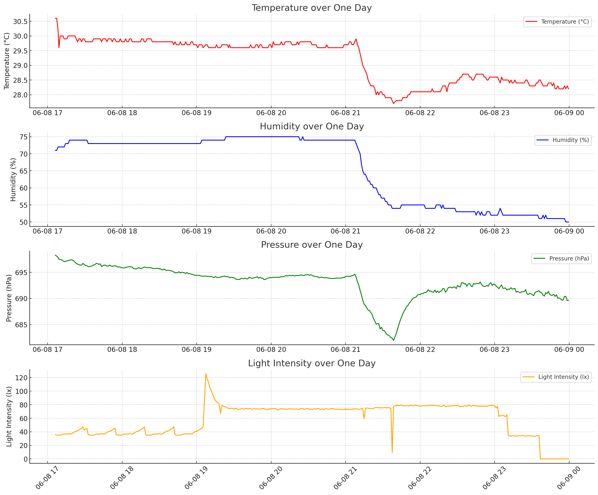
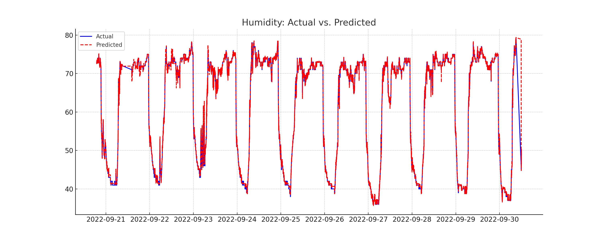
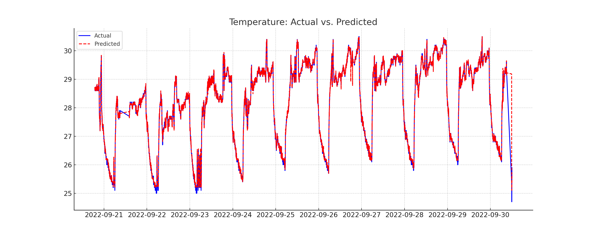
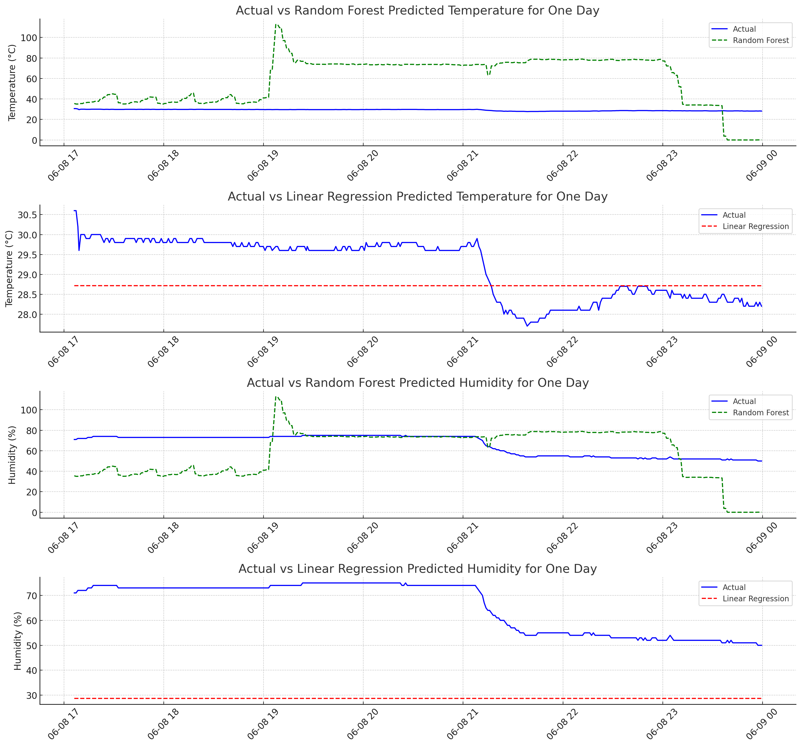
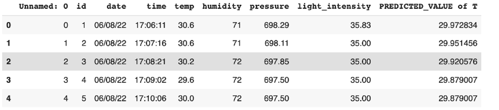
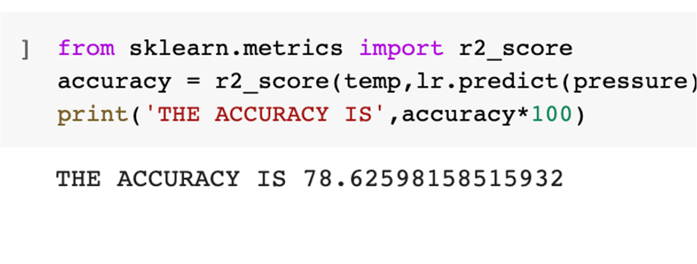
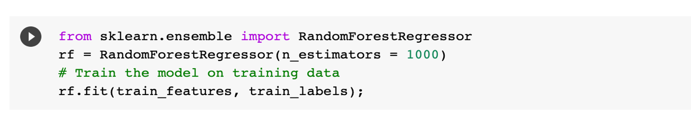
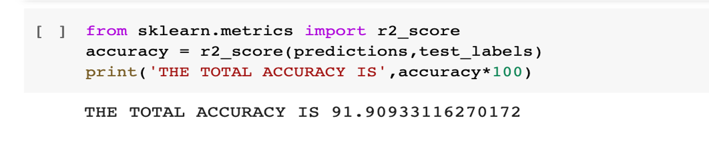

# Machine Learning Predictions with Data Preprocessing

## Overview

This repository demonstrates the process of data preprocessing and the application of machine learning algorithms to make predictions based on collected environmental data. The data, originally logged by an ESP8266 microcontroller, undergoes cleaning, feature engineering, and analysis before being used in two common regression algorithms: Linear Regression and Random Forest.

## Project Structure

- `data.csv` - Contains the raw and preprocessed data files.
- `notebooks/` - Jupyter notebooks detailing the data preprocessing and model development steps.
- `models/` - Trained machine learning models and model evaluation results.(not uploaded to github due to file size constraints)

## Data Preprocessing

- Raw data collected from ESP8266 is cleaned and preprocessed.
- Missing values are handled using appropriate techniques.
- Feature engineering is performed to extract relevant features for modeling.
- Data is split into training and testing sets for model evaluation.

## Machine Learning Models

1. **Linear Regression:**
   - Linear regression models are applied to the preprocessed data.
   - As assumed the accuracy was pretty abysmal but was a great benchmark

2. **Random Forest Regression:**
   - Random forest regression models are employed.
   - Hyperparameter tuning and model optimization are explored.
   - Evaluation metrics and feature importance are analyzed.

